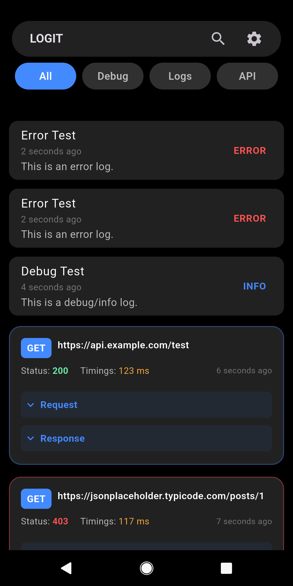
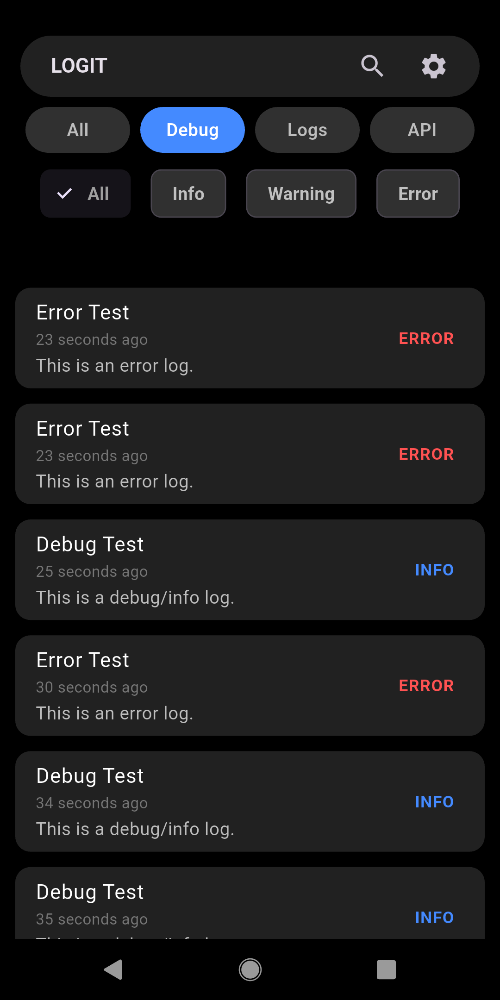
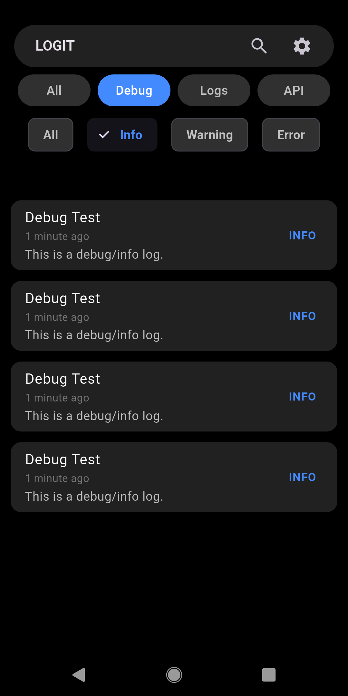
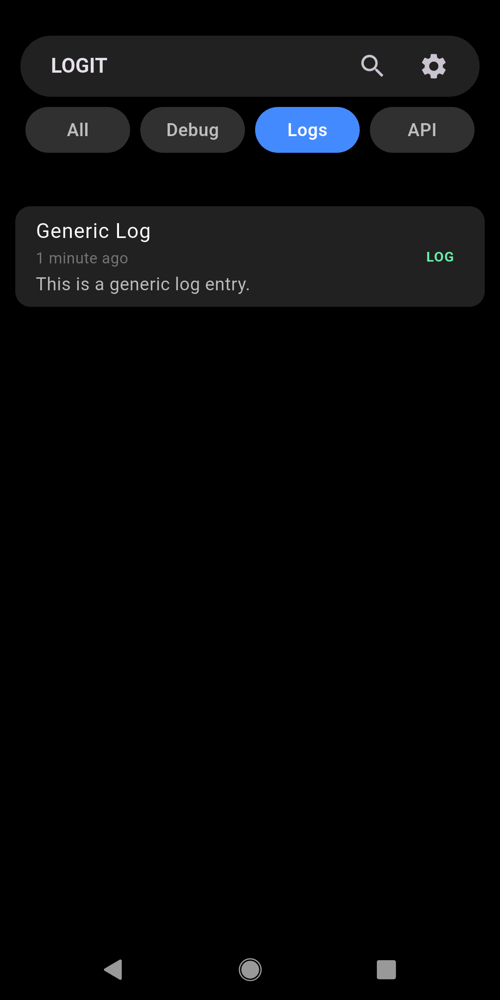
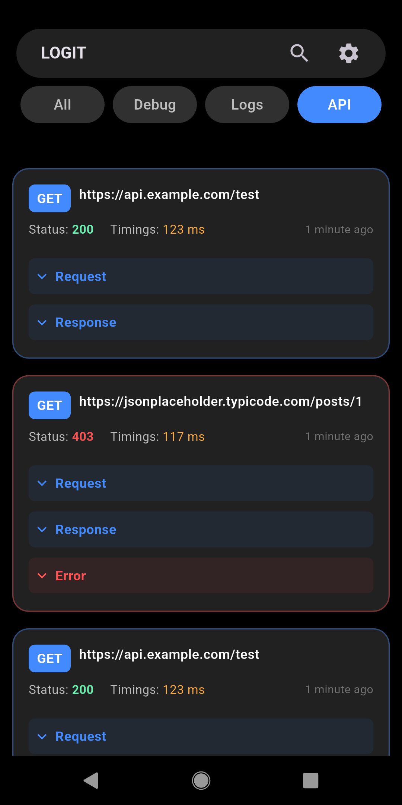
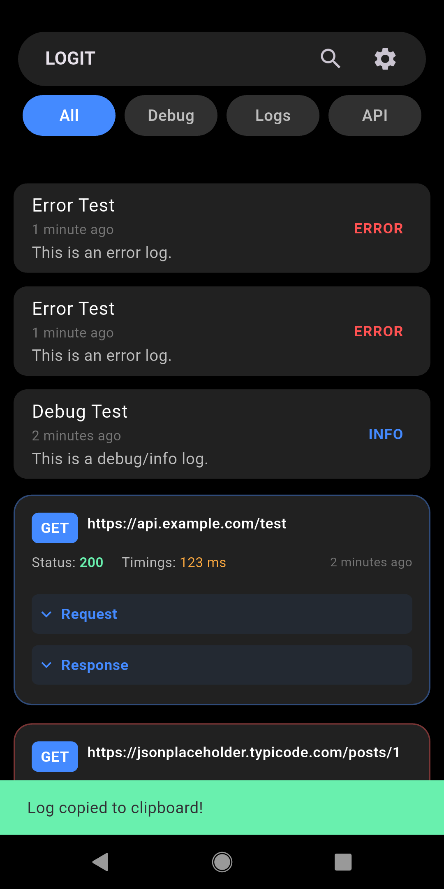
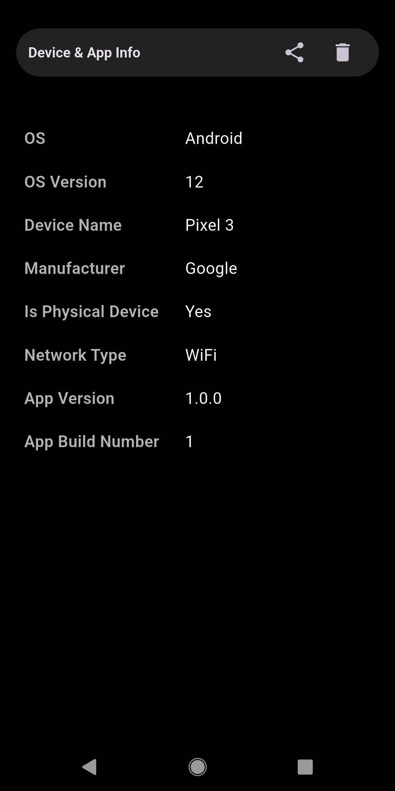
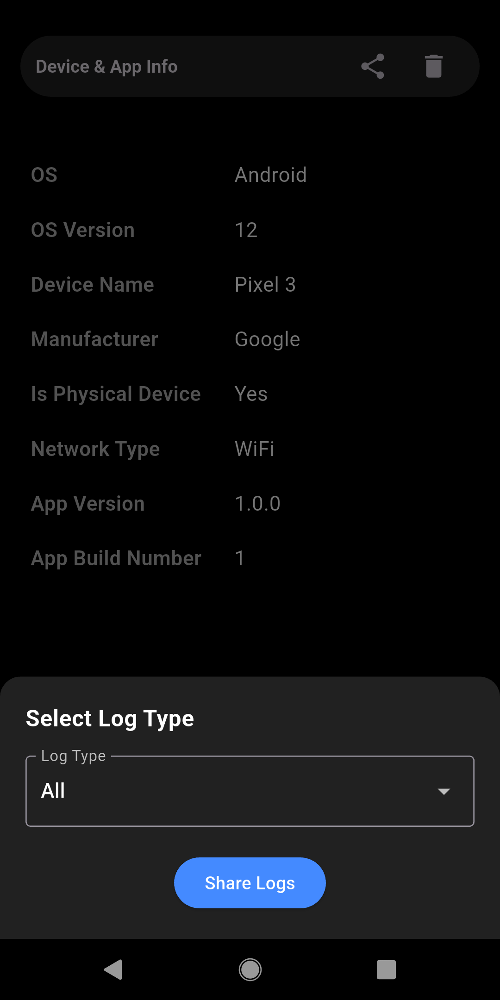
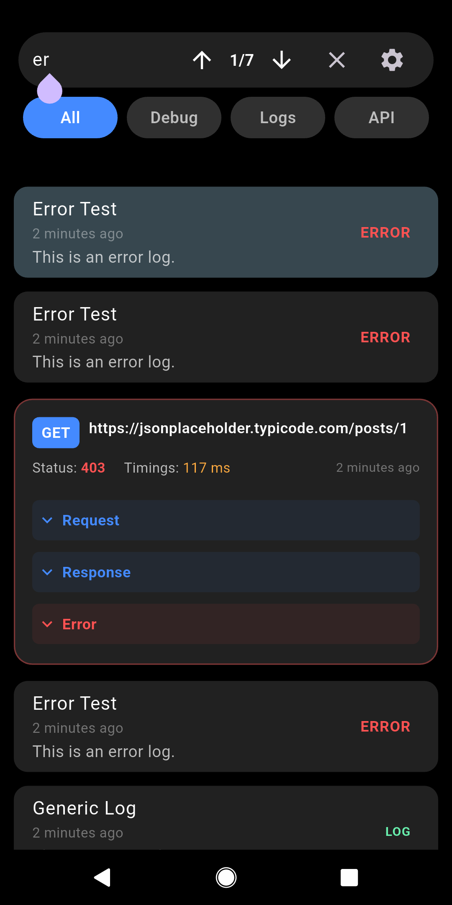

<!-- 
This README describes the package. If you publish this package to pub.dev,
this README's contents appear on the landing page for your package.

For information about how to write a good package README, see the guide for
[writing package pages](https://dart.dev/tools/pub/writing-package-pages). 

For general information about developing packages, see the Dart guide for
[creating packages](https://dart.dev/guides/libraries/create-packages)
and the Flutter guide for
[developing packages and plugins](https://flutter.dev/to/develop-packages). 
-->

# LogitX Flutter Plugin

A developer-friendly Flutter plugin to capture, view, and manage logs inside your app. Supports Debug, Logs, and API logs.

## Features
- **Floating, rounded app bar**: Modern, elevated app bar that appears to float at the top of the overlay and settings screens.
- **Segmented tab navigation**: Switch between All, Debug, Logs, and API logs with a single tap.
- **Debug log filtering**: Filter debug logs by Info, Warning, or Error with color-coded chips.
- **Monospaced font throughout**: All text uses a coding-style monospaced font for clarity and consistency.
- **Expandable API log cards**: View detailed request/response info, headers, timings, and more.
- **Powerful search and filter**: Search logs with match navigation and highlighting.
- **Export and share logs**: Export logs as JSON or text, share with device/app info, or clear logs.
- **Settings page**: View device/app info, share logs, and clear logs from a dedicated settings screen.
- **Dio and http integration**: Automatically log API calls from Dio and http clients.
- **Riverpod state management**: Robust, testable log state management.
- **Modular, documented code**: All classes, widgets, and services are split into files and fully documented with Dart doc comments.
- **Modern dark overlay UI**: Always accessible, beautiful, and easy to use.
- **Compatible with Android, iOS, and Web**

## Getting Started

### 1. Add Dependency
```yaml
dependencies:
  logitx: ^1.0.0
```

### 2. Initialize in main()
```dart
import 'package:logit/logit.dart';

void main() {
  Logit.init(const LoggerConfig(
    enableInDebug: true,
    allowedIds: ['test@dev.com'],
    enableLongPressGesture: true,
    enablePersistence: true,
    maxStoredLogs: 100,
  ));
  runApp(const MyApp());
}
```

### 3. Initialize the Provider Container
```dart
WidgetsBinding.instance.addPostFrameCallback((_) {
      LogitCore.attachLongPress(context, userId: 'test@dev.com');
      // Initialize provider container for API logging
      if (LogitCore.container == null) {
        final container = ProviderScope.containerOf(context);
        LogitCore.initializeProviderContainer(container);
        // Also initialize LoggerDio's container
        LoggerDio.initializeProviderContainer(container);
      }
    });
```

### 4. Log Messages
```dart
Logit.debug('Debug message');
Logit.api('GET', 'https://api.example.com', headers: {}, body: {}, statusCode: 200);
Logit.log('General log message');
```

### 5. Dio Integration
```dart
final dio = Dio();
dio.interceptors.add(LoggerDio());  // Add the logger interceptor

// All API calls will be automatically logged
final response = await dio.get('https://api.example.com/data');
```

## Testing
The plugin includes comprehensive test coverage for all logging functionality:

### Unit Tests
```dart
void main() {
  test('should log API call', () {
    // Initialize logger for testing
    Logit.init(const LoggerConfig(
      enableInDebug: true,
      enablePersistence: false,
    ));

    // Perform logging
    Logit.api(
      heading: 'Test API',
      content: 'Response data',
      method: 'GET',
      url: 'https://api.test.com',
      headers: {},
    );

    // Assert logs were created
    final logs = LogitCore.instance.logs;
    expect(logs.length, 1);
    expect(logs.first.heading, 'Test API');
  });
}
```

### Testing with Dio Interceptor
The `LoggerDio` interceptor can be tested independently:

```dart
test('should log Dio API calls', () {
  final loggerDio = LoggerDio();
  final requestOptions = RequestOptions(
    path: '/test',
    method: 'GET',
  );
  
  // Test request logging
  loggerDio.onRequest(requestOptions, RequestInterceptorHandler());
  
  // Verify timing information is added
  expect(requestOptions.extra['devLoggerStartTime'], isA<DateTime>());
});
```

## Screenshots
Below are some screenshots showcasing the functionality of this plugin:

<table>
  <tr>
    <td></td>
    <td></td>
    <td></td>
  </tr>
  <tr>
    <td></td>
    <td></td>
    <td></td>
  </tr>
  <tr>
    <td></td>
    <td></td>
    <td></td>
  </tr>
</table>

## Export Logs
Logs can be exported in JSON or plain text format using the export modal.

## Contributing
Contributions are welcome! Please follow the guidelines in CONTRIBUTING.md.

## License
This project is licensed under the MIT License. See LICENSE for details.

## Additional Information

- For more details on the API, check out the [API Documentation](doc/api/index.html).
- If you find any issues or have a feature request, please file them on the [GitHub repository](https://github.com/vignarajj/dev_loggerx).

## Platform Support
This plugin supports the following platforms:

- **Android**
- **iOS**
- **Web**
